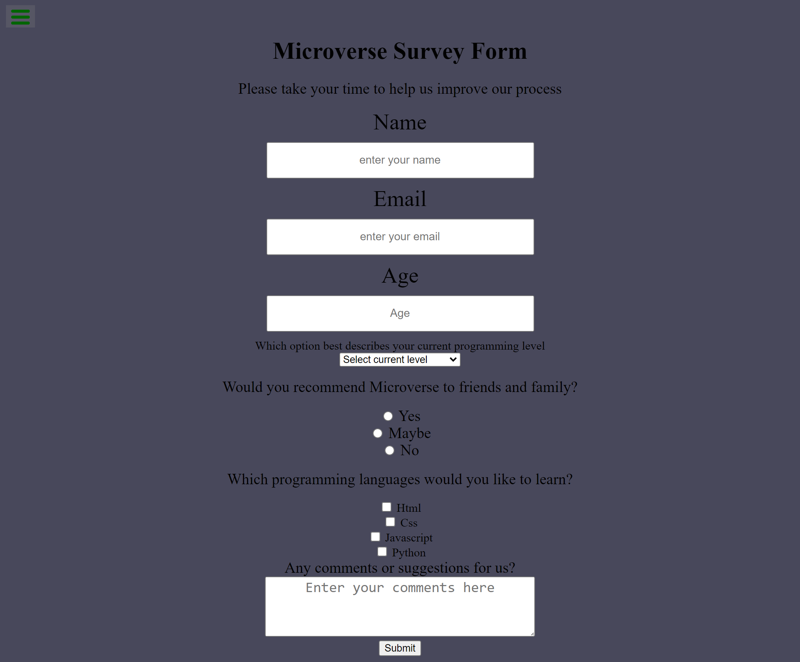

# Mobile Version

![Screenshot]

> This is a Microverse Project that requires us to perform a code review on one of the previous projects we did before getting admission to Microverse.

## Live Demo Link
[Live Demo Link](http://127.0.0.1:5500/)

## Built With

- HTML
- CSS
- Visual Studio Code Editor
- Git & Github

## Getting Started
To get a local copy up and running:
1. Clone this repository or download the Zip folder:
**``git clone https://github.com/Gambit142/Code-Review.git``**
2. Navigate to the location of the folder in your machine:
**``you@your-Pc-name:~$ cd <folder>``**

## Authors

👤 **Author1**

- GitHub: Francis Ugorji [@githubhandle](https://github.com/Gambit142)
  
- LinkedIn: [LinkedIn] (www.linkedin.com/in/francis-ugorji-a567b7168)

👤 **Author2**

- GitHub: King Josaphat Chewa [@githubhandle](https://https://github.com/Kingjosh007)

## 🤝 Contributing

Contributions, issues, and feature requests are welcome!

Feel free to check the [issues page](../../issues/).

## Show your support

Give a ⭐️ if you like this project!

## Acknowledgments

- Hat tip to Microverse for the opportunity to use their platform to grow.
- Hat tip to Microverse for well curated curriculum. Microverse [Home Page](https://bit.ly/MicroverseTN
)
- My Coding Partners 🏹
- My Morning Session Partners ⚡

## 📝 License

This project is [MIT](./MIT.md) licensed.